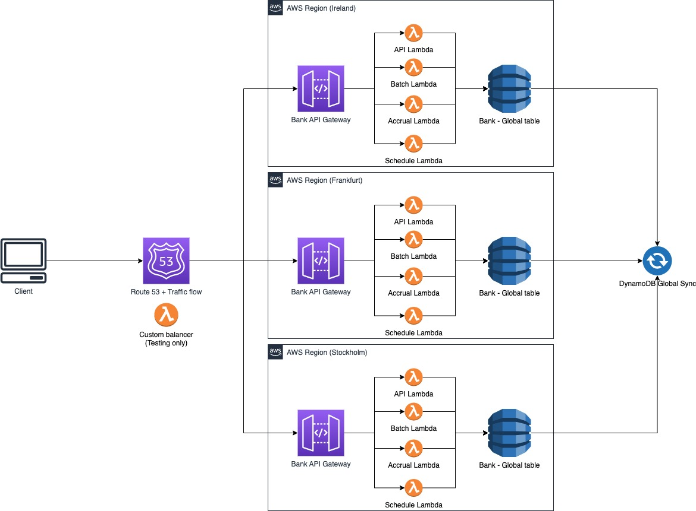
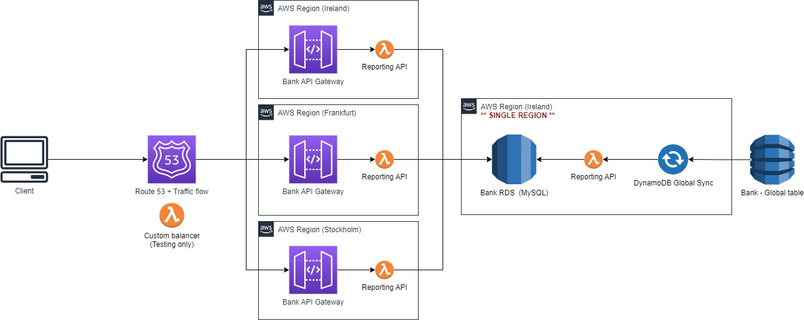
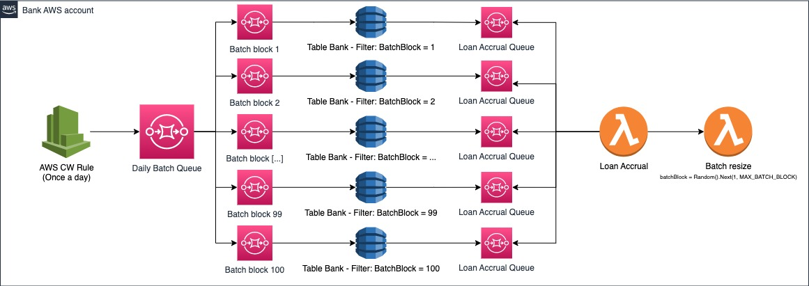

# Lending bank
#### This project is just a personal studying, trying to create a transactional bank environment running with multi-active regions.


## Features
- Loan simulation
- Installment preview/calculation
- Compound interest
- Convertible interest frequencies (daily, monthly, yearly)
- PRICE and SAC amortizations
- IOF tax (daily and additional)
- Disbursement
- Repayment
- Transactions
- Ledger accounts and journal transactions
- Reporting (API or MySQL)

## Architecture proposal
- Java Spring Boot
- Hexagonal architecture
- CQRS
- Distributed lock (e.g.: account id)
- Distributed batch processing
- Single table design (DynamoDB)
- Isolated reporting MySQL

## Multi-Region Active-Active (Ireland, Frankfurt, and Stockholm) 



### Challenges and trade-offs
- Distributed Ids -> Currently each region ID generator is parsed to a billion prefix, e.g.: Ireland: 1000000000 + atomic counter, Frankfurt: 2000000000 + atomic counter
- Transactions -> DynamoDB provides single region ACID transactions guarantees, not globally, the (ongoing) proposal would be to create a Round robin algorithm and force the same path param to be redirected to the same region, but Round robin could be a challenge using route 53, which is recommended for production environments

## Reporting



### Challenges and trade-offs
- Multi-Region RDS -> Work in progress....


## Distributed batch



## Infrastructure cost estimation per feature
-- ToDo 

--- 

## Example 1

- Amount: $ 10.000 
- Term: 4 Months
- Amortization: PRICE
- Interest rate: 16.55 % / Year
- Tax: IOF


#### POST /api/loan
```json
{
  "accountId": 2000000052,
  "amount": 10000,
  "term": 4,
  "interestRate": 16.55,
  "amortizationType": "PRICE",
  "interestFrequency": "YEAR",
  "disbursementDate": "2023-03-07",
  "tax": "IOF"
}
```

--- 

```json
{
  "loan": {
    "loanId": 1000000076,
    "accountId": 2000000052,
    "type": "PRICE",
    "amount": 10101.33,
    "state": "DRAFT",
    "term": 4,
    "interestFrequency": "YEAR",
    "interestRate": 16.55,
    "creationDate": "2023-03-15T20:28:34.882",
    "disbursementDate": "2023-03-07T00:00:00",
    "lastAccrualDate": "2023-03-15T20:28:34.861",
    "accruedInterest": 34.39,
    "additionalInformation": [
      "Daily interest: 0.0425508000 %",
      "Monthly interest: 1.2844303000 %",
      "Yearly interest: 16.55 %"
    ]
  },
  "installments": [
    {
      "number": 1,
      "amortizationType": "PRICE",
      "state": "PENDING",
      "dueDate": "2023-04-07T00:00:00",
      "paymentDate": null,
      "principal": {
        "amount": 2477.2,
        "paid": 0
      },
      "interest": {
        "amount": 129.74,
        "paid": 0
      },
      "tax": {
        "amount": 25.59,
        "paid": 0
      },
      "installmentAmount": 2632.53,
      "remainingBalance": 7624.13,
      "taxComposition": {
        "ADDITIONAL_IOF": 9.41,
        "DAILY_IOF": 6.3
      }
    },
    {
      "number": 2,
      "amortizationType": "PRICE",
      "state": "PENDING",
      "dueDate": "2023-05-08T00:00:00",
      "paymentDate": null,
      "principal": {
        "amount": 2509.01,
        "paid": 0
      },
      "interest": {
        "amount": 97.93,
        "paid": 0
      },
      "tax": {
        "amount": 25.59,
        "paid": 0
      },
      "installmentAmount": 2632.53,
      "remainingBalance": 5115.12,
      "taxComposition": {
        "ADDITIONAL_IOF": 9.53,
        "DAILY_IOF": 12.76
      }
    },
    {
      "number": 3,
      "amortizationType": "PRICE",
      "state": "PENDING",
      "dueDate": "2023-06-07T00:00:00",
      "paymentDate": null,
      "principal": {
        "amount": 2541.24,
        "paid": 0
      },
      "interest": {
        "amount": 65.7,
        "paid": 0
      },
      "tax": {
        "amount": 25.59,
        "paid": 0
      },
      "installmentAmount": 2632.53,
      "remainingBalance": 2573.88,
      "taxComposition": {
        "ADDITIONAL_IOF": 9.66,
        "DAILY_IOF": 19.17
      }
    },
    {
      "number": 4,
      "amortizationType": "PRICE",
      "state": "PENDING",
      "dueDate": "2023-07-07T00:00:00",
      "paymentDate": null,
      "principal": {
        "amount": 2573.88,
        "paid": 0
      },
      "interest": {
        "amount": 33.06,
        "paid": 0
      },
      "tax": {
        "amount": 25.59,
        "paid": 0
      },
      "installmentAmount": 2632.53,
      "remainingBalance": 0,
      "taxComposition": {
        "ADDITIONAL_IOF": 9.78,
        "DAILY_IOF": 25.75
      }
    }
  ],
  "installmentDetails": {
    "installmentsTotalAmount": 10530.12,
    "principalTotalAmount": 10101.33,
    "interestTotalAmount": 326.43,
    "taxesTotalAmount": 102.36,
    "taxes": {
      "ADDITIONAL_IOF": 38.38,
      "DAILY_IOF": 63.98
    }
  }
}
``` 
---
* Postman collection available

## Setup

#### Credentials and env variables

AWS_REGION =;

AWS_PROFILE={YOUR_PROFILE};

AWS_ACCESS_KEY_ID=;

AWS_SECRET_ACCESS_KEY=;

DATABASE_URL=;

DATABASE_SECRET_NAME=;

#### SAM

Deploy SAM Mac: sam build && sam deploy --profile {YOUR_PROFILE}

Deploy SAM Windows: sam build "&&" sam deploy --profile {YOUR_PROFILE}